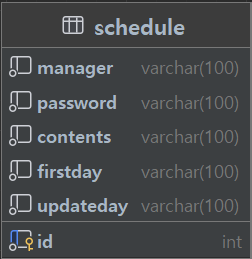

| 기능       | Method | URL                        | request      | response               | 상태 코드   |
|----------|--------|----------------------------|--------------|------------------------|---------|
| 일정 등록    | post   | /api/schedule              | {name,date}  | {schedule.add(name)}   | 200: 정상 |
| 일정 조회    | get    | /api/schedule/{scheduleId} | {managerId}  | {check(managerId)}     | 200: 정상 |
| 일정 목록 조회 | get    | /api/schedule              | {managerId}  | {checkList(managerId)} | 200: 정상 |
| 일정 수정    | put    | /api/schedule/{scheduleId} | {scheduleId} | {update(scheduleId)}   | 200: 정상 |
| 일정 삭제    | delete | /api/schedule/{scheduleId} | {scheduleId} | {delete(scheduleId)}   | 200: 정상 |
// DTO 를 여기서도 적용? 위에 내용은 시작 전.

 // 5단계까지 작성 후 수정해보기 

| 기능       | Method | URL                        | request                                            | response               | 상태 코드   |
|----------|--------|----------------------------|----------------------------------------------------|------------------------|---------|
| 일정 등록    | post   | /api/schedule              | {String manager, String password, String contents} | {schedule.add(name)}   | 200: 정상 |
| 일정 조회    | get    | /api/schedule/{scheduleId} | {int scheduleId}                                   | {check(managerId)}     | 200: 정상 |
| 일정 목록 조회 | get    | /api/schedule              | {managerId}                                        | {checkList(managerId)} | 200: 정상 |
| 일정 수정    | put    | /api/schedule/{scheduleId} | {scheduleId}                                       | {update(scheduleId)}   | 200: 정상 |
| 일정 삭제    | delete | /api/schedule/{scheduleId} | {scheduleId}                                       | {delete(scheduleId)}   | 200: 정상 |

